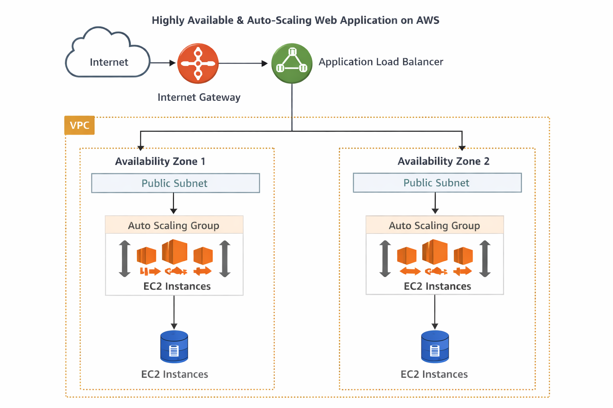
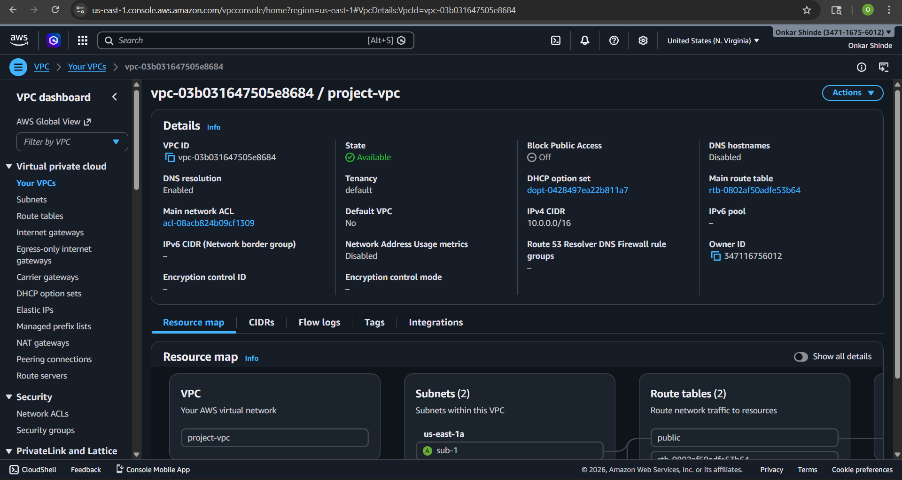
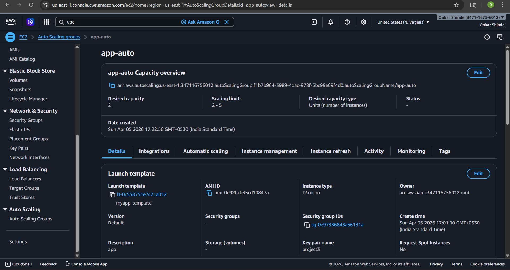
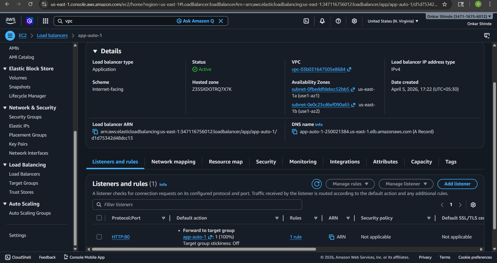
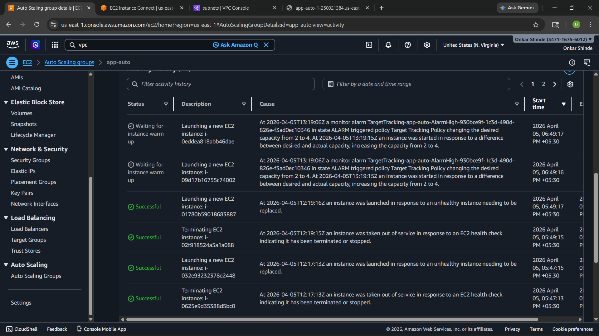
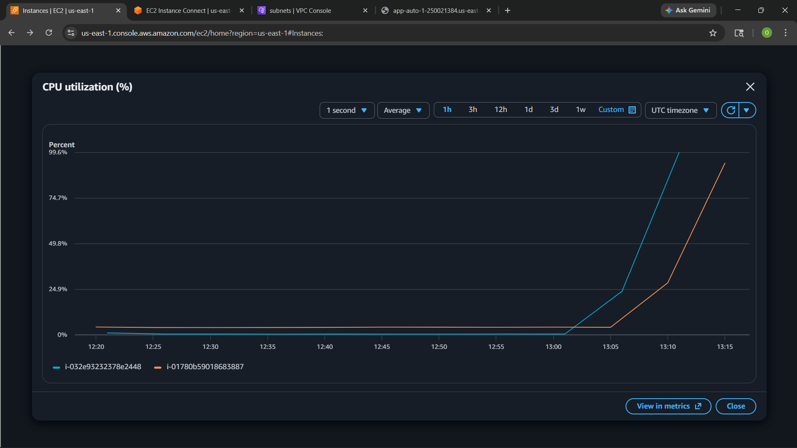

# 🚀 Highly Available Web Application using Auto Scaling & Load Balancer (AWS)

---

## 📌 Project Overview

This project demonstrates how to design and implement a **highly available and fault-tolerant web application** on AWS.

The architecture automatically handles:

* Traffic spikes
* Instance failures
* Load distribution

---

## 🎯 Objective

To build a system that:

* Ensures **zero downtime**
* Automatically **scales based on demand**
* Eliminates **single point of failure**

---

## 🧰 Technologies Used

* AWS EC2
* Auto Scaling Group (ASG)
* Application Load Balancer (ALB)
* CloudWatch
* VPC (Virtual Private Cloud)

---

## 🏗️ Architecture Diagram

---

## 🧠 Architecture Explanation

### 🔹 Traffic Flow

User request flow:

Internet → Internet Gateway → Application Load Balancer → Auto Scaling Group → EC2 Instances

---

### 🔹 Key Components

#### 1. VPC

* Custom Virtual Private Cloud
* Provides isolated network environment

#### 2. Public Subnets (Multi-AZ)

* Two subnets in different Availability Zones
* Ensures high availability

#### 3. Internet Gateway

* Allows communication between VPC and Internet

#### 4. Application Load Balancer (ALB)

* Distributes incoming traffic across EC2 instances
* Performs health checks
* Routes traffic only to healthy instances

#### 5. Auto Scaling Group (ASG)

* Maintains minimum number of EC2 instances
* Automatically scales based on CPU usage
* Replaces unhealthy instances automatically

#### 6. EC2 Instances

* Hosts the web application
* Configured using Launch Template

---

## ⚙️ Implementation Steps

### Step 1: Networking Setup

* Created custom VPC
* Created 2 public subnets in different AZs
* Attached Internet Gateway
* Configured route tables

---

### Step 2: Launch Template

* Installed Apache web server using User Data
* Deployed simple web application

---

### Step 3: Auto Scaling Group

* Minimum instances: 2
* Maximum instances: 5
* Scaling policy based on CPU utilization

---

### Step 4: Application Load Balancer

* Created ALB
* Attached target group
* Enabled health checks

---

## 🔄 High Availability Strategy

**1. Multi-AZ Deployment**
- Runs in multiple availability zones  
- Failure of one zone does not stop system  

**2. Load Balancing**
- Distributes traffic evenly  

**3. Health Checks**
- Sends traffic only to healthy instances  

**4. Auto Healing**
- Automatically replaces failed servers  

**5. No Single Point of Failure**
- System continues even if one component fails  

---

## 📈 Scaling Mechanism

* CloudWatch monitors CPU utilization
* When CPU increases:
  → New EC2 instances are launched (Scale Out)
* When CPU decreases:
  → Extra instances are terminated (Scale In)

---

## 🧪 Testing & Validation

### 🔹 Load Testing

* Simulated high traffic using browser/Apache Benchmark
* Observed auto scaling behavior

### 🔹 Failover Testing

* Manually terminated an EC2 instance
* ASG automatically launched a new instance

---

## 📸 Screenshots

### VPC Setup

### Auto Scaling Group

### Load Balancer

### Scaling Events

### CloudWatch Metrics

---

## 📊 Key Outcomes

* Achieved high availability using Multi-AZ setup
* Implemented automatic scaling based on demand
* Ensured zero downtime using self-healing architecture

---

## 🚀 Conclusion

This project successfully demonstrates a **production-ready architecture** that:

* Handles traffic spikes efficiently
* Recovers from failures automatically
* Provides high availability and scalability

---

## 👨‍💻 Author

Onkar Shinde
